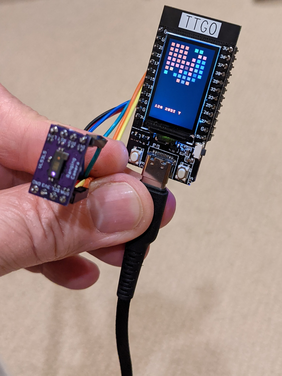
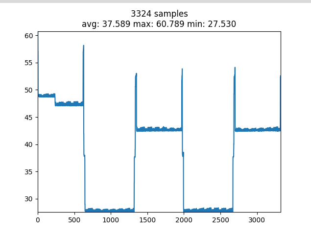

# VL53L5CX MicroPython and CircuitPython Package

This package provides a class that is (mostly) a straight port of the ST [Ultra Lite Driver (ULD) C module](https://www.st.com/content/st_com/en/products/embedded-software/imaging-software/stsw-img023.html). With this class, you can configure and acquire data from a VL53L5CX sensor in both 4x4 and 8x8 resolutions. You can find details on the sensor operation and API in the [ST user manual UM2884](https://www.st.com/resource/en/user_manual/um2884-a-guide-to-using-the-vl53l5cx-multizone-timeofflight-ranging-sensor-with-wide-field-of-view-ultra-lite-driver-uld-stmicroelectronics.pdf). The figure below shows a graphical display of a color depth map for an 8x8 resolution sample, `demo.py`.



The code has been tested with the VL53L5CX breakout board from [Pesky Products on Tindie](https://www.tindie.com/products/onehorse/vl53l5cx-ranging-camera/) using a [Pimoroni Tiny 2040](https://shop.pimoroni.com/products/tiny-2040) with both MicroPython (v1.16) and CircuitPython (v7.0) and a [LILYGO TTGO T-Display](http://www.lilygo.cn/prod_view.aspx?TypeId=50062&Id=1126&FId=t3:50062:3) using MicroPython (v1.17).

## Installation

Copy the `vl53l5cx` directory to your board's `lib` directory using the usual mechanism for your board. The firmware file, `vl_fw_config.bin`, is generated from the ULD source file `vl53lcx_buffers.h` using the `fw_file.c` utility.

### MicroPython

``` bash
mpremote mkdir :lib/vl53l5cx
mpremote cp vl53l5cx/__init__.py :lib/vl53l5cx/__init__.py
mpremote cp vl53l5cx/_config_file.py :lib/vl53l5cx/_config_file.py
mpremote cp vl53l5cx/mp.py :lib/vl53l5cx/mp.py
mpremote cp vl53l5cx/vl_fw_config.bin :lib/vl53l5cx/vl_fw_config.bin
```

You could also compile the source files first using `mpy-cross` and then copy the corresponding `.mpy` files.

### CircuitPython

``` bash
cp -r vl53l5cx path-to-cp-disk/lib
```

There are no external dependencies for the `vl53l5cx` package. Some examples may have external requirements.

## Usage

The VL53L5CX class requires at least an I2C device to interact with the sensor. In addition, depending on your HW (board), you may require a Pin for the LPN pin. If your board pulls this pin low, you will need to connect a Pin to pull the LPN pin high. In addition, this Pin can be supplied to the VL53L5CX class to perform a soft reset.

The interface for the class is the same for both MicroPython and CircuitPython, but the objects used to create an instance are different. The `sensor.py` utility module encapsulates the differences for each platform and keeps from duplication in the examples. You can use this as-is or just copy the code for your platform into your applications.

### MicroPython Create

``` python
from machine import I2C, Pin

from vl53l5cx.mp import VL53L5CXMP

scl_pin, sda_pin, lpn_pin, _ = (22, 21, 12, 13)
i2c = I2C(0, scl=Pin(scl_pin, Pin.OUT), sda=Pin(sda_pin), freq=1_000_000)

tof = VL53L5CXMP(i2c, lpn=Pin(lpn_pin, Pin.OUT, value=1))
```

### CircuitPython Create

``` python
import busio
from microcontroller import pin
from digitalio import DigitalInOut, Direction

from vl53l5cx.cp import VL53L5CXCP

scl_pin, sda_pin, lpn_pin, _ = (pin.GPIO1, pin.GPIO0, pin.GPIO28, pin.GPIO5)
i2c = busio.I2C(scl_pin, sda_pin, frequency=1_000_000)

lpn = DigitalInOut(lpn_pin)
lpn.direction = Direction.OUTPUT
lpn.value = True

tof = VL53L5CXCP(i2c, lpn=lpn)
```

You will need to adjust the pin numbers/ids based on your board's connections to the VL53L5CX sensor.

### Basic Example

Once you have an instance, the code to interact with the sensor is the same, so the examples below do not show the creation code. Instead, this code is factored out into a helper module, `sensor.py`, that provides a wrapper function, `make_sensor`.


``` python
from sensor import make_sensor

from vl53l5cx import DATA_TARGET_STATUS, DATA_DISTANCE_MM
from vl53l5cx import STATUS_VALID, RESOLUTION_4X4


def main():
    tof = make_sensor()
    tof.reset()

    if not tof.is_alive():
        raise ValueError("VL53L5CX not detected")

    tof.init()

    tof.resolution = RESOLUTION_4X4
    grid = 3

    tof.ranging_freq = 2

    tof.start_ranging({DATA_DISTANCE_MM, DATA_TARGET_STATUS})

    while True:
        if tof.check_data_ready():
            results = tof.get_ranging_data()
            distance = results.distance_mm
            status = results.target_status

            for i, d in enumerate(distance):
                if status[i] == STATUS_VALID:
                    print("{:4}".format(d), end=" ")
                else:
                    print("xxxx", end=" ")

                if (i & grid) == grid:
                    print("")

            print("")


main()
```

Run the example using the method appropriate for your platform.

``` bash
linux$ mpremote run basic.py
xxxx 1564  671 1754
xxxx 1537 1834 1770
xxxx 1572 1665 1736
xxxx xxxx xxxx 1727

xxxx xxxx  671 1754
xxxx 1530 1857 1765
xxxx 1546 1665 1751
xxxx xxxx xxxx 1703

xxxx xxxx  671 1743
xxxx 1566 1857 1717
xxxx 1560 1665 1744
xxxx 1543 1616 1712
```

### Selecting Results

You can select all or a subset of the nine possible results produced by the sensor when starting operation via `start_ranging()`. The `Results` object returned from `get_ranging_data()` will contain a property for each of the specified results. Note that the single argument to `start_ranging()` is a set, list, or other iterable.

``` python
from vl53l5cx import DATA_TARGET_STATUS, DATA_DISTANCE_MM

tof.start_ranging({DATA_TARGET_STATUS, DATA_DISTANCE_MM})

results = tof.get_ranging_data()

print(len(results.distance_mm), len(results.target_status))
```

| start_ranging() option | Results property  |
|:-:|:-:|
| DATA_AMBIENT_PER_SPAD | ambient_per_spad |
| DATA_NB_SPADS_ENABLED | nb_spads_enabled |
| DATA_NB_TARGET_DETECTED | nb_target_detected |
| DATA_SIGNAL_PER_SPAD | signal_per_spad |
| DATA_RANGE_SIGMA_MM | range_sigma_mm |
| DATA_DISTANCE_MM | distance_mm |
| DATA_REFLECTANCE | reflectance |
| DATA_TARGET_STATUS | target_status |
| DATA_MOTION_INDICATOR | motion_indicator |

### Interrupt Example

Instead of polling for data available via the `check_data_ready` method, you can use the interrupt pin from the VL53L5CX to signal data is ready. The examples below show how this can be used with the `light sleep` functionality in both MicroPython and CircuitPython.

``` python
# MicroPython
from machine import lightsleep, Pin
from esp32 import wake_on_ext1, WAKEUP_ALL_LOW

from sensor import make_sensor

from vl53l5cx import DATA_TARGET_STATUS, DATA_DISTANCE_MM
from vl53l5cx import RESOLUTION_4X4


def main():
    wake_on_ext1([Pin(13, Pin.IN)], WAKEUP_ALL_LOW)

    tof = make_sensor()
    tof.reset()
    tof.init()

    tof.resolution = RESOLUTION_4X4
    tof.ranging_freq = 30

    tof.start_ranging({DATA_DISTANCE_MM, DATA_TARGET_STATUS})

    while True:
        lightsleep()

        results = tof.get_ranging_data()
        print(min(results.distance_mm), max(results.distance_mm))


main()
```

``` python
# CircuitPython
import alarm
from microcontroller import pin

from sensor import make_sensor

from vl53l5cx import DATA_TARGET_STATUS, DATA_DISTANCE_MM
from vl53l5cx import RESOLUTION_4X4


def main():
    pin_alarm = alarm.pin.PinAlarm(pin=pin.GPIO5, value=False, pull=True)

    tof = make_sensor()
    tof.reset()
    tof.init()

    tof.resolution = RESOLUTION_4X4
    tof.ranging_freq = 30

    tof.start_ranging({DATA_DISTANCE_MM, DATA_TARGET_STATUS})

    while True:
        alarm.light_sleep_until_alarms(pin_alarm)

        results = tof.get_ranging_data()
        print(min(results.distance_mm), max(results.distance_mm))


main()
```

### Power Example

The VL53L5CX can be operated in a "sleep" (LP idle) mode where it consumes less power when not ranging. The [data sheet](https://www.st.com/resource/en/datasheet/vl53l5cx.pdf) lists the current consumption in Section 4.4.


The example below shows how to switch between "wakeup" (HP idle) and "sleep" (LP idle) using the `power_mode` property. Measured current consumption (including SoC and board usage) is shown in the graph.

``` python
from time import sleep

from sensor import make_sensor

from vl53l5cx import POWER_MODE_WAKEUP, POWER_MODE_SLEEP


def main():
    tof = make_sensor()
    tof.reset()
    tof.init()

    assert(tof.power_mode == POWER_MODE_WAKEUP)
    sleep(0.5)

    tof.power_mode = POWER_MODE_SLEEP
    assert(tof.power_mode == POWER_MODE_SLEEP)
    sleep(0.5)

    tof.power_mode = POWER_MODE_WAKEUP
    assert(tof.power_mode == POWER_MODE_WAKEUP)
    sleep(0.5)

    tof.power_mode = POWER_MODE_SLEEP
    assert(tof.power_mode == POWER_MODE_SLEEP)
    sleep(0.5)

    tof.power_mode = POWER_MODE_WAKEUP
    assert(tof.power_mode == POWER_MODE_WAKEUP)
    sleep(0.5)


main()
```



## TODO

* Add threshold support
* Add motion indicator support
* xtalk calibration support to enable custom xtalk config data rather than default
* More than one target per zone (fixed at 1 currently)
